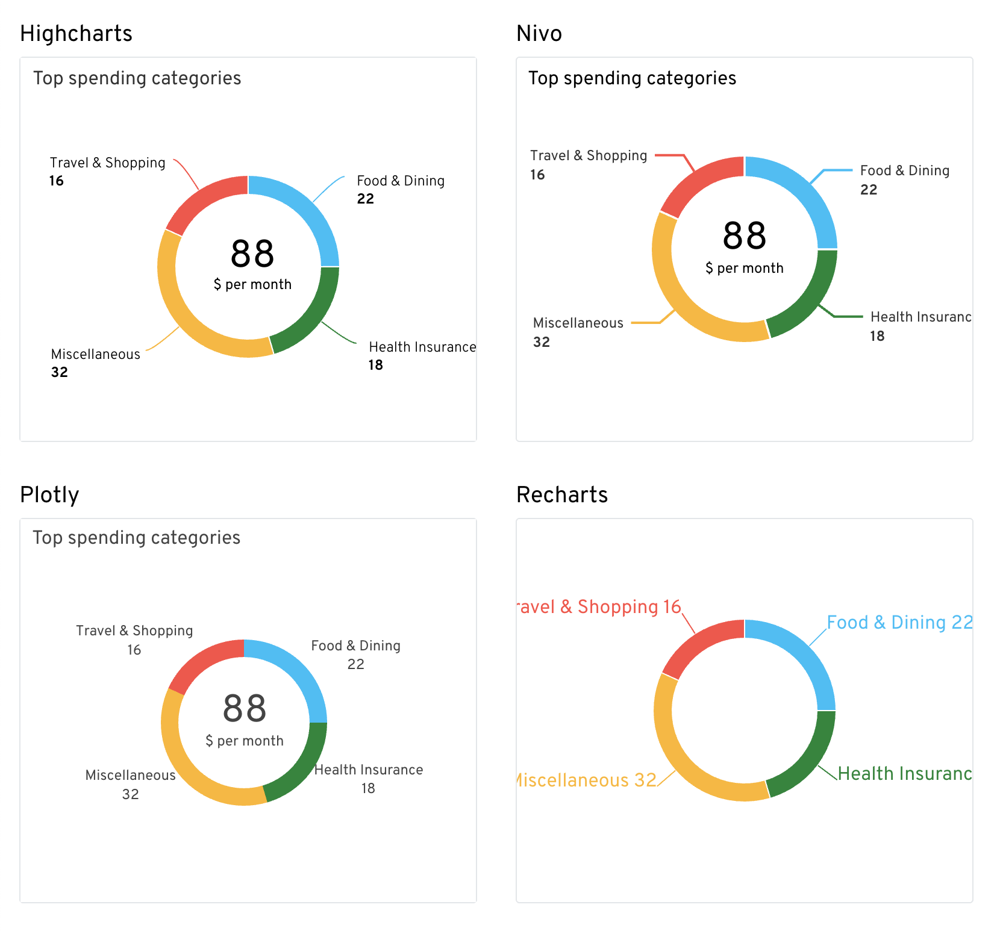

# Charts Demo

This project compares 4 charting libraries using the example of a donut chart.



This project was bootstrapped with
[React Accelerate](https://github.com/PublicisSapient/cra-template-accelerate).
It is based on [Create React App](https://github.com/facebook/create-react-app)
and is designed to accelerate React application development by providing
guidance, libraries and tools to encourage you to write web applications using
best practices.

Clone the repo listed below to see a small example of how to use this template:

[Accelerated News](https://github.com/PublicisSapient/accelerated-news)

## Features

1. TypeScript based - for type safety
2. [Opinionated folder structure](docs/folder-structure.md)
3. Foundational libraries
   - [React Router](https://reactrouter.com/)
4. Essential tools
   - [Storybook](https://storybook.js.org/) to develop UI components in
     isolation
   - [React Testing Library](https://testing-library.com/) for unit testing
   - [Cypress](https://www.cypress.io/) for end-to-end testing
   - [Husky](https://typicode.github.io/husky) to improve the quality of commits
   - [Mock Service Worker](https://mswjs.io/) to mock HTTP requests
   - [Prettier](https://prettier.io/) to format code consistently
5. Some useful starter components:
   - **ErrorBoundary**: A component to catch JavaScript errors anywhere in its
     child component tree and display a fallback UI.
   - **Loading**: A placeholder loading component
   - **EnvProvider**: Provides a mechanism for loading environment variables
     dynamically by placing an environment file (`env.js`) in the `/public`
     folder. This allows a single build to be used across multiple environments
     such as develop, qa, uat & prod.
   - **Home**: A simple page showing end-to-end flow from client to server. It
     makes an HTTP request to the server, which is intercepted by Mock Service
     Worker (in development mode) and displays a list of movies. The unit test
     for this page does not have to do any jest level mocking, demonstrating the
     power of MSW.
   - **NotFound**: A placeholder NotFound page
   - **Sample Storybook Stories**: Showing best practices in Storybook
   - **Unit Testing**: Utility functions to make testing easier. Also, some
     sample tests to show best practices.
   - **End-to-End Testing**: Sample Cypress tests to show best practices.

## Getting Started

Make sure your development machine is set up for building React apps. See the
recommended setup procedure [here](docs/dev-machine-setup.md).

Execute the following commands to install dependencies:

```sh
# if using yarn v7 add --legacy-peer-deps option
# see details here: https://github.com/storybookjs/storybook/issues/12983
yarn install
```

Now execute the following commands to run the app:

```sh
yarn start
```

Now point your browser to http://localhost:3000/.

## Running Storybook

Storybook is a powerful tool for developing UI components in isolation,
independent of the final app they will be deployed in. This approach has the
following benefits:

1. Develop components without needing to build entire screens, fuss with data or
   business logic
2. Render components in key states that are tricky to reproduce in an app
3. Document components with examples and properties

React Accelerate comes ready with Storybook. Execute the following command to
run Storybook.

```sh
yarn storybook
```

## Running Unit Tests

React Accelerate comes ready with Jest and React Testing Library to run unit
tests. Execute one of the following command to run unit tests.

```sh
yarn test # interactive mode
yarn test:coverage # non-interactive mode with coverage information
```

Note that unit tests are automatically executed when you commit code to your
local repo. This ensures that you are not committing broken code.

## Running End-to-End Tests

React Accelerate comes ready with Cypress to run end-to-end tests. Execute
Cypress using the following commands:

```sh
yarn start # starts a local server hosting your react app

# run cypress in a different shell
yarn cypress:open
```

## Code Formatting

React Accelerate uses Prettier to consistently and easily format code. Prettier
is an opinionated code formatter that provides the following benefits:

1. Code is formatted automatically without any fuss
2. There is no need to discuss style in code review
3. Saves you time and energy

Prettier is automatically executed when you commit code to your local repo. You
can also execute it manually using the following command:

```sh
yarn format
```

## Learn More

- [React Accelerate Documentation](docs)
- [Create React App documentation](https://facebook.github.io/create-react-app/docs/getting-started)
- [React documentation](https://reactjs.org/)
- [How to know what to test](https://kentcdodds.com/blog/how-to-know-what-to-test)
- [Write tests. Not too many. Mostly integration.](https://kentcdodds.com/blog/write-tests)
- [State Colocation - Where to Put State](https://kentcdodds.com/blog/state-colocation-will-make-your-react-app-faster)
- [How to use React Context effectively](https://kentcdodds.com/blog/how-to-use-react-context-effectively)
